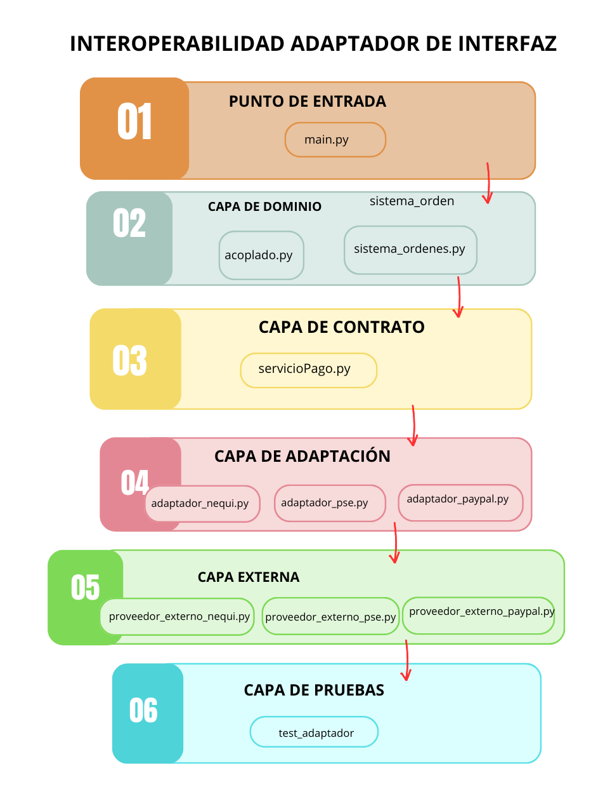

# Order-system-interoperability 

Implementación del patrón **Adaptador de Interfaz** como estrategia de interoperabilidad entre un sistema principal de órdenes y proveedores externos de pago (PSE, PayPal, Nequi). Demuestra el problema del acoplamiento directo, su impacto ante cambios externos y la solución mediante el patrón adaptador con arquitectura en capas.

---

## Comenzando 

_Estas instrucciones te permitirán obtener una copia del proyecto en funcionamiento en tu máquina local para propósitos de desarrollo y pruebas._

```bash
git clone https://github.com/RobinsonMolina/Order-system-interoperability.git

cd Order-system-interoperability
```

### Pre-requisitos

Solo necesitas Python instalado. El proyecto no tiene dependencias externas.

```
Python 3.10 o superior
```

Verifica tu versión con el comando:

```bash
python --version
```

### Instalación 

_El proyecto no requiere instalación de librerías. Clona el repositorio y ejecútalo directamente._

**1. Clona el repositorio:**

```bash
git clone https://github.com/tu-usuario/Order-system-interoperability.git
```

**2. Entra a la carpeta del proyecto:**

```bash
cd Order-system-interoperability
```

**3. Ejecuta el menú interactivo:**

```bash
python main.py
```

Verás el siguiente menú:

```
══════════════════════════════════════════════════════════
  TALLER II — INTEROPERABILIDAD ADAPTADOR DE INTERFAZ
══════════════════════════════════════════════════════════
  1. Acoplamiento directo - PSE (Funciona)
  2. Acoplamiento directo - Paypal (Falla por acoplamiento)
  3. Sistema con Adaptador (Estable)
  4. Ejecutar Pruebas
  0. Salir

De esta manera el la opcion 1 corresponde al paso 1, la opcion 2 al paso 2, la opcion 3 fusiona el paso 3, el paso 4 e inmerso en ella el paso 6, la opcion 4 se referiere al paso 5 y la opcion corrrespondiente para salir del sistema. Este menú fue pensado para ser lo más sencillo posible.

Los pasos se encuentran en el documento Taller_Interoperabilidad_Adaptador.pdf
```

---

## Estructura del proyecto 

```
Order-system-interoperability/
├── main.py                         # Punto de entrada — menú interactivo
├── README.md                         #Readme técnico                   
│
├── interfaz/
│   └── servicioPago.py              # ServicioPago (ABC) — contrato estable
│
├── sistema_orden/
│   ├── acoplado.py                  # Pasos 1 y 2 — sistema acoplado (antipatrón)
│   └── sistema_ordenes.py           # Pasos 3,4 y 6 — sistema desacoplado
│
├── adaptador/
│   ├── adaptador_pse.py             # Traduce PSE ↔ contrato interno
│   ├── adaptador_paypal.py          # Traduce PayPal ↔ contrato interno
│   └── adaptador_nequi.py           # Traduce Nequi ↔ contrato interno
│
├── proveedor/
│   ├── proveedor_externo_pse.py     # PSE — interfaz original
│   ├── proveedor_externo_paypal.py  # PayPal — interfaz incompatible
│   └── proveedor_externo_nequi.py   # Nequi — interfaz completamente distinta
│
└── test/
│   └── test_adaptador.py            # Pruebas automatizadas con unittest
│
├── assets/
│   ├── diagrama_arquitectura.png                  
│   └── Taller_Interoperabilidad_Adaptador.pdf                             # Instrucciones taller
│   └── TTaller2_Interoperabilidad_AlixonLopez_RobinsonMolina.pdf           # Documento final taller

```
## Diagrama simple de arquitectura.



---

## Ejecutando las pruebas 

Las pruebas verifican que el sistema principal funcione correctamente con cualquier proveedor y que el contrato interno nunca se rompa.
```bash
python -m unittest discover -s test -v
```

### Pruebas del contrato interno 

Verifican que `ServicioPago` es abstracta y que el sistema respeta el contrato en todo momento.

### Pruebas de adaptadores e intercambiabilidad 

Verifican que cada adaptador traduce correctamente y que el sistema produce el mismo resultado con PSE, PayPal o Nequi sin ninguna modificación.

## Despliegue 

Este proyecto es académico y no requiere despliegue en producción. Para ejecutarlo en cualquier entorno basta con tener Python 3.10+ instalado y correr `python main.py` desde la raíz del proyecto.


## Construido con 

* [Python 3.10+](https://www.python.org/) — Lenguaje de programación
* [unittest](https://docs.python.org/3/library/unittest.html) — Framework de pruebas (librería estándar)
* [abc](https://docs.python.org/3/library/abc.html) — Clases abstractas para el contrato interno (librería estándar)

## Articulo 

Puedes encontrar la documentación completa del taller en el documento pdf denominado Taller2_Interoperabilidad_AlixonLopez_RobinsonMolina.pdf

---

## Autores 

* **Alixon Lopez** - *Desarrollo completo* - [Alix0n]((https://github.com/Alix0n)
* **Robinson Molina** - *Desarrollo completo* - [RobinsonMolina]((https://github.com/RobinsonMolina)

---
